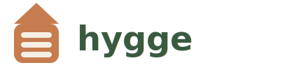

# hygge



A cozy, comfortable data movement framework that makes data feel at home.

## Philosophy

hygge (pronounced "hoo-ga") is a Danish word representing comfort, coziness, and well-being. This framework brings those qualities to data movement:

- **Comfort**: You should relax while you move some tables.
- **Simplicity**: Clean, intuitive APIs that feel natural
- **Reliability**: Robust, predictable behavior without surprises
- **Flow**: Smooth, efficient movement without friction

### Built on Polars + PyArrow

hygge is built on **Polars with PyArrow backend** for optimal data movement performance. This combination provides:
- Efficient columnar memory format for large datasets
- Automatic batching and streaming capabilities
- Broad database compatibility via SQLAlchemy
- Zero-copy operations where possible
- Clean, intuitive API that feels natural

We chose Polars because it provides the best balance of performance, developer experience, and compatibility for extract-and-load workflows.

## Core Concepts

### Home
Where data starts its journey. A home is a comfortable, familiar place that data lives before moving. All homes yield Polars DataFrames:

```python
home = SQLHome(
    "users",
    connection=conn,
    options={'batch_size': 10_000}
)

async for df in home.read():
    # Each batch is a Polars DataFrame
    # Data flows naturally in columnar format
```

### Store
Where data rests after its journey. A store provides a cozy place for data to settle. All stores accept Polars DataFrames:

```python
store = ParquetStore(
    "users",
    path="data/users",
    options={'compression': 'snappy'}
)

await store.write(df)  # Write Polars DataFrame directly
```

### Flow
The natural movement of data from home to store:

```python
flow = Flow(
    home=SQLHome("users"),
    store=ParquetStore("users")
)

await flow.start()  # Data moves comfortably
```

### Coordinator
Orchestrates multiple flows with care:

```python
# Automatic project discovery
coordinator = Coordinator()
await coordinator.run()  # Runs all flows in parallel

# Or specify config explicitly (for testing/scripting)
coordinator = Coordinator(config_path="custom_config.yml")
await coordinator.run()
```

## Design Principles

1. **Comfort Over Complexity**
   - APIs should feel natural and intuitive
   - Configuration should be simple but flexible
   - Defaults should "just work"

2. **Flow Over Force**
   - Data should move smoothly between systems
   - Batching and buffering should happen naturally
   - Progress should be visible but unobtrusive

3. **Reliability Over Speed**
   - Prefer robust, predictable behavior
   - Handle errors gracefully
   - Make recovery simple

4. **Clarity Over Cleverness**
   - Simple, clear code over complex optimizations
   - Explicit configuration over implicit behavior
   - Clear logging and progress tracking

## Quick Start

### Initialize a New Project

```bash
hygge init my-project
cd my-project
```

This creates a comfortable project structure:
```
my-project/
├── hygge.yml           # Project configuration
└── flows/              # Flow definitions
    └── example_flow/
        ├── flow.yml    # Flow configuration
        └── entities/   # Entity definitions
            └── users.yml
```

### Configure Your Flow

Edit `flows/example_flow/flow.yml` to point to your data:

```yaml
name: "example_flow"
home:
  type: "parquet"
  path: "data/source"
store:
  type: "parquet"
  path: "data/destination"

defaults:
  key_column: "id"
  batch_size: 10000
```

Add or edit entities in `flows/example_flow/entities/` to define what data to move:

```yaml
name: "users"
columns:
  - id
  - name
  - email
  - created_at
```

### Execute Your Flows

```bash
# Execute all flows
hygge go

# Debug your configuration
hygge debug

# Get help
hygge --help
```

That's it! hygge discovers your project structure and makes your data feel at home.

See the `samples/` directory for configuration examples and the `examples/` directory for programmatic usage.

## Data Sources

hygge supports multiple data sources with a simple, consistent API.

### Parquet Files

```yaml
home:
  type: parquet
  path: data/source
```

### MS SQL Server

Extract data from MS SQL Server with Azure AD authentication and connection pooling:

```yaml
connections:
  my_database:
    type: mssql
    server: myserver.database.windows.net
    database: mydatabase
    pool_size: 8  # Concurrent connections

flows:
  users_to_parquet:
    home:
      type: mssql
      connection: my_database
      table: dbo.users
    store:
      type: parquet
      path: data/users
```

**Features:**
- Azure AD authentication (Managed Identity, Azure CLI, Service Principal)
- Connection pooling for efficient concurrent access
- Entity pattern for extracting 10-200+ tables
- Custom SQL queries supported

**Prerequisites:**
- ODBC Driver 18 for SQL Server (`brew install msodbcsql18` on macOS)
- Azure AD authentication configured
- Database permissions granted to your identity

See `samples/mssql_*.yaml` for complete examples.

## CLI Reference

### `hygge init PROJECT_NAME`

Initialize a new hygge project with a comfortable structure:

```bash
hygge init my-project
hygge init my-project --flows-dir pipelines  # Custom flows directory name
hygge init my-project --force                 # Overwrite existing project
```

### `hygge go`

Execute all flows in the current project:

```bash
hygge go              # Execute all flows
hygge go --verbose    # Enable detailed logging
hygge go --flow NAME  # Execute specific flow (coming soon)
```

### `hygge debug`

Validate and inspect your project configuration:

```bash
hygge debug  # Shows project details and discovered flows
```

## Extensibility

Adding new homes and stores feels natural and comfortable:

```python
class MyHome(Home):
    """A cozy new home for data."""
    async def read_batches(self):
        # Implement your reading logic
        pass

class MyStore(Store):
    """A cozy new store for data."""
    async def write(self, df):
        # Implement your writing logic
        pass
```

hygge automatically discovers and registers your custom implementations, making them available in your configurations just like the built-in types.

## Development Philosophy

- Keep it simple and focused
- Make common tasks easy
- Make complex tasks possible
- Prioritize user experience
- Write clear, maintainable code
- Test thoroughly but sensibly

hygge isn't just about moving data - it's about making data movement feel natural, comfortable, and reliable.
